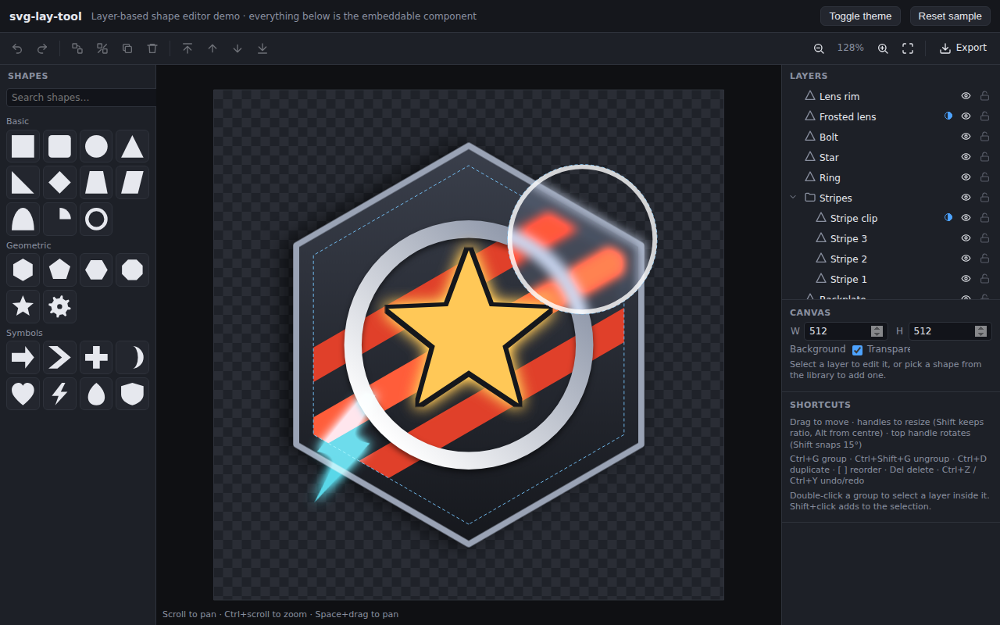

# svg-lay-tool

An embeddable, framework-agnostic image editor that builds pictures from a
**library of shapes stacked on layers** — in the spirit of the emblem/decal
editor in Armored Core VI and the layer editor in KWGT.

Shapes can be coloured (solid or gradient), resized, positioned, rotated and
flipped. Any layer can act as a **mask** that clips, or applies effects to, the
layers below it. Layers can be **grouped** and moved, scaled and rotated
together. Everything renders to clean SVG and exports to SVG, PNG or JSON.

**Live demo:** https://jonathansatterthwaite-stack.github.io/Svg-lay-tool/



- Zero runtime dependencies, ~22 kB gzipped for the full editor.
- Drop it into any app: plain `new SvgLayEditor(element)`, a
  `<svg-lay-editor>` custom element, or a `<script>` tag.
- Styles live in a shadow root so your CSS and the editor's never collide.
- A headless `core` entry renders documents to SVG strings anywhere
  (browser, Node, workers) — useful for thumbnails or server-side export.

## Install

```sh
npm install svg-lay-tool
```

Or build from this repository (`npm install && npm run build`) and copy `dist/`.

## Quick start

### With a bundler (Vite, webpack, Next, SvelteKit …)

```ts
import { SvgLayEditor } from 'svg-lay-tool';

const editor = new SvgLayEditor(document.querySelector('#host')!, {
  width: 512,
  height: 512,
  background: null, // transparent
  theme: 'dark',    // or 'light'
});

editor.on('change', (doc) => localStorage.setItem('emblem', JSON.stringify(doc)));

// Later…
const svg = editor.exportSvg();          // string
const png = await editor.exportPng({ scale: 2 }); // Blob
```

The host element needs a size; the editor fills it (`min-height: 420px`).

### As a custom element

```html
<script type="module">
  import { defineSvgLayEditor } from 'svg-lay-tool';
  defineSvgLayEditor(); // registers <svg-lay-editor>
</script>

<svg-lay-editor width="512" height="512" theme="dark" color-mode="full" style="height: 600px"></svg-lay-editor>

<script type="module">
  const el = document.querySelector('svg-lay-editor');
  el.addEventListener('change', (e) => console.log(e.detail)); // the document
  el.document = savedDocument;     // load
  el.editor.exportSvg();           // full API via .editor
</script>
```

### With a plain `<script>` tag

```html
<script src="svg-lay-tool.iife.js"></script>
<script>
  const editor = new SvgLayTool.SvgLayEditor(document.getElementById('host'));
</script>
```

### React / Vue / Svelte

Mount it in an effect and destroy it on unmount:

```tsx
function Emblem({ value, onChange }) {
  const ref = useRef<HTMLDivElement>(null);
  useEffect(() => {
    const editor = new SvgLayEditor(ref.current!, { document: value, onChange });
    return () => editor.destroy();
  }, []);
  return <div ref={ref} style={{ height: 600 }} />;
}
```

## Concepts

### Document

```ts
interface SvgDocument {
  version: 1;
  width: number;
  height: number;
  background: string | null; // CSS colour or null = transparent
  layers: Layer[];           // bottom first
}
```

Documents are plain JSON: save them, diff them, generate them. Load untrusted
JSON through `normalizeDocument()` (the editor's `loadDocument()` does this).

### Layers

Every layer has `x`, `y` (its origin in the parent's space), `rotation`
(degrees), `opacity`, `blendMode`, `visible`, `locked`, a list of `effects`
and an optional `mask`.

- **Shape layers** reference a shape from the library by id, with `width`,
  `height`, `flipX`/`flipY`, shape `params` (sides, corner radius …) and a
  base `color`. Fill overrides, strokes, effects, masks and geometry changes
  are modifiers (see below).
  The origin is the centre of the shape. `width` × `height` is the size the
  geometry is generated at; `rotation` turns it rigidly, and `stretch` is a
  canvas-axis stretch applied afterwards. Rotating never distorts a shape,
  while resizing works along the canvas axes even when rotated (a square
  rotated 45° and widened becomes a wide diamond, which then keeps that look
  if rotated again). Use `rotateShape()`, `scaleShapeBox()` and
  `setShapeBoxSize()` rather than editing these fields by hand; an
  axis-aligned stretch at 0° or 90° is folded back into `width`/`height`.
- **Group layers** hold `children`, a uniform `scale` and, like shapes, a
  `rotation` and canvas-axis `stretch`. Children are positioned relative to
  the group's origin (its pivot). When you group a selection the origin is
  placed at the selection's centre. Groups rotate rigidly and resize along
  the canvas axes exactly as shapes do; `rotateLayer()`, `scaleLayerBox()`
  and `setLayerBoxSize()` work on both kinds.

### Modifiers

Everything beyond position, size, rotation and the base `color` is a
**modifier** in `layer.modifiers`, edited in the Modifiers panel (desktop:
under the layer settings; mobile: its own tab). A shape with no modifiers is
simply filled with its colour. Modifier types:

| type     | what it does                                                                    |
| -------- | ------------------------------------------------------------------------------- |
| `fill`   | replaces the colour fill with a gradient, another solid or no fill               |
| `stroke` | outlines the shape; colour defaults to the layer colour                          |
| `effect` | one effect (blur, shadow, glow, outline, tint …); stack several for a chain      |
| `mask`   | turns the layer into a mask over the layers below (see Masks)                    |
| `deform` | trapezoid / skew warp: top and bottom width %, top offset % (a rectangle with a narrow top is a trapezoid; top 0 is a triangle) |
| `edges`  | subdivides every straight edge and bends the new points in or out; smooth curves optional (a pentagon with one inward subdivision is a star; outward + smooth gives petals) |

Geometry modifiers (`deform`, `edges`) apply in order before painting;
several can be stacked. `createModifier(type, init)`, `createEffectModifier()`
and `createMaskModifier()` build them; `addModifier()`, `updateModifier()`,
`removeModifier()` and `moveModifier()` edit a layer's stack. Documents saved
by earlier versions (with `fill`, `stroke`, `effects`, `mask` fields, or the
removed `star`/`quad` shapes) are converted on load.

### Masks

Add a `mask` modifier and the layer stops drawing itself; instead it affects
the layers **below it inside the same parent** (so a mask inside a group only
touches that group's siblings):

| mode           | what happens to the layers below                                   |
| -------------- | ------------------------------------------------------------------ |
| `clip`         | only visible inside the mask shape                                 |
| `clip-inverse` | only visible outside the mask shape                                |
| `filter`       | stay visible; inside the shape the mask's `effects` are applied    |

While editing, the canvas shows what a clip mask hides at 25 % opacity and
fills hidden mask shapes faintly, so the result of moving or resizing a mask is
visible (`features.maskPreview`, editor only; exports never include it).

`mask.effects` is a list of the same effects available on layers — so
"blur everything under this circle", "invert inside this star" or "clip the
stripes to the shield" are all one layer each. The mask layer's own opacity and
effects apply to the mask itself (blur the mask for a soft edge). A group can be
a mask too: the union of its children is the mask shape. Tick `showShape` to
also draw the mask layer normally.

### Effects

`blur`, `brightness`, `contrast`, `saturate`, `hue-rotate`, `grayscale`,
`sepia`, `invert`, `tint`, `shadow`, `glow`, `outline`. Each is a small object
(`{ type: 'blur', radius: 4, enabled: true }` …) carried by an `effect`
modifier; `createEffectModifier(type)` gives you one with defaults. They
compile to SVG `<filter>` primitives, so exported files look identical to the
canvas.

### Shape library

A small set of parametric shapes covers what used to be many fixed ones:

| shape        | parameters                                   | covers                                         |
| ------------ | -------------------------------------------- | ---------------------------------------------- |
| Polygon      | sides (3–24), corner radius                  | rectangle, rounded rectangle, triangle, pentagon, hexagon, octagon …; with a `deform` modifier: trapezoid, parallelogram, right triangle; with an `edges` modifier: stars, gears, flowers |
| Ellipse / arc| sweep angle, start angle, hole               | circle, ellipse, ring, pie, semicircle, annular sector |
| Gear         | teeth, tooth depth, hole                     |                                                |
| Arrow        | head length, shaft thickness, corner radius  | arrow, arrowhead                               |
| Chevron      | thickness, corner radius                     |                                                |
| Plus / cross | arm thickness, corner radius                 |                                                |
| Crescent, heart, lightning, teardrop, shield | (lightning has corner radius) |                                  |

A 4-sided polygon is an axis-aligned rectangle filling the layer's box, and
every polygon has a flat bottom edge. Legacy ids such as `rect`, `hexagon`,
`ring`, `trapezoid` or `star` are still accepted by `createShapeLayer()` and
by loaded documents; they map onto the parametric shapes with matching
parameters (and a `deform` or `edges` modifier where needed).

Add your own — a shape is just a function from size to path data, centred on
the origin:

```ts
import { registerShape } from 'svg-lay-tool';

registerShape({
  id: 'kite',
  name: 'Kite',
  category: 'Custom',
  params: [{ key: 'waist', label: 'Waist %', min: 10, max: 90, step: 1, default: 35 }],
  path: (w, h, p) => {
    const y = -h / 2 + h * (p.waist / 100);
    return `M0 ${-h / 2} L${w / 2} ${y} L0 ${h / 2} L${-w / 2} ${y} Z`;
  },
});
```

Register shapes before creating the editor, or call `editor.refreshLibrary()`
afterwards. Restrict the palette with `shapes: ['rect', 'ellipse', 'star']` in
the options.

## Theming

The UI is built from CSS custom properties. Set any of them on the editor's
host element, or on `:root`, and the editor uses them; change them later
(for example when your app switches theme) and the editor follows instantly,
because custom properties inherit into the shadow root.

```css
:root {
  --slt-accent: var(--brand-primary);
  --slt-bg: var(--surface-0);
  --slt-panel: var(--surface-1);
  --slt-text: var(--on-surface);
  --slt-font: inherit;
}
```

| token                       | used for                                    |
| --------------------------- | ------------------------------------------- |
| `--slt-bg`                  | editor background                           |
| `--slt-panel`, `--slt-panel-2` | panels, cards, buttons                    |
| `--slt-border`              | separators and input borders                |
| `--slt-text`, `--slt-muted` | text                                        |
| `--slt-accent`, `--slt-accent-text` | selection, handles, primary buttons  |
| `--slt-input-bg`            | inputs                                      |
| `--slt-hover`, `--slt-selected` | row hover / selected states             |
| `--slt-danger`              | destructive hover                           |
| `--slt-canvas`, `--slt-checker-a`, `--slt-checker-b` | canvas surround and transparency checkerboard |
| `--slt-radius`, `--slt-font`, `--slt-font-size` | shape of controls and typography |

Anything you do not set falls back to the built-in preset chosen by the
`theme` option: `'dark'` (default), `'light'`, or `'auto'` to follow the
operating system. Switch at runtime with `editor.setTheme()`. If you would
rather pass values from JavaScript, `colors: { accent: '#ff0080', radius: '2px' }`
in the options (or `editor.setColors()`) applies them inline; `clearColors()`
removes them again.

## Features and colour modes

The `features` option switches capabilities on or off so the editor matches
what your app can use. Everything defaults to on.

```ts
new SvgLayEditor(host, {
  features: {
    colorMode: 'monochrome',   // 'full' | 'grayscale' | 'monochrome'
    monoColor: '#ffffff',      // paint colour in monochrome mode
    gradients: false,
    strokes: true,
    effects: ['blur', 'outline', 'shadow'], // true | false | whitelist
    masks: true,
    groups: true,
    blendModes: false,
    opacity: true,
    export: false,             // hide the export/save/open menu
    canvasSize: false,         // fixed canvas size
    background: false,         // no background editing
    shapes: ['rect', 'ellipse', 'star', 'ring'],
  },
});
```

Change them later with `editor.setFeatures({ ... })`; the UI and canvas update
immediately.

**Colour modes** are meant for apps that colour the image themselves, for
instance by using hue and saturation for their own purposes:

- `grayscale`: colour pickers become lightness sliders and the renderer
  converts every colour (fills, gradients, strokes, effect colours, background)
  to a gray of the same lightness. Effects that would introduce colour (hue,
  saturation, sepia) are hidden and skipped.
- `monochrome`: there are no colour controls at all. Everything is painted in
  `monoColor`, so the result is a shaped alpha image built from shapes, opacity
  and clip masks that your app can tint. Gradients and blend modes are disabled;
  only blur, shadow, glow and outline remain (in the mono colour).

On the canvas the selected layer is painted in a contrasting colour while in
monochrome mode (`features.highlightSelection`), so it stays visible among
identical shapes; exports are unaffected.

The mode is enforced in the renderer, not just the UI: `exportSvg()`,
`exportPng()` and the canvas all apply it, so a document loaded from a file
with colours in it still comes out gray or mono. Headless users get the same
via `renderDocumentToString(doc, { colorMode: 'grayscale' })`.

## Editor API

```ts
new SvgLayEditor(host: HTMLElement, options?: EditorOptions)
```

| option              | description                                                                    |
| ------------------- | ------------------------------------------------------------------------------ |
| `document`          | initial document (otherwise built from `width`/`height`/`background`)         |
| `theme`             | `'dark'` (default), `'light'` or `'auto'`                                      |
| `colors`            | inline theme token overrides, see Theming                                      |
| `features`          | capability switches and colour mode, see Features                              |
| `layout`            | `'auto'` (default), `'desktop'` or `'mobile'`; see Mobile layout                |
| `mobileBreakpoint`  | width in px below which `auto` uses the mobile layout (default 700)            |
| `panels`            | `{ toolbar, library, layers, properties }` booleans to hide UI parts          |
| `shapes`            | list of shape ids allowed in the library                                       |
| `shadow`            | `false` to render into light DOM instead of a shadow root                      |
| `onChange`          | called with the document after every committed change                          |
| `onSelectionChange` | called with the selected layer ids                                             |

Methods (all changes are undoable):

- Document: `document`, `getDocument()`, `loadDocument(docOrJson)`, `toJson()`
- Selection: `select(ids, additive?)`, `toggleSelect(id)`, `clearSelection()`, `selectAll()`, `selectedLayers()`
- Editing: `addShape(shapeId, init?)`, `deleteSelection()`, `duplicateSelection()`, `groupSelection()`,
  `ungroupSelection()`, `reorderSelection('forward' | 'backward' | 'front' | 'back')`,
  `updateSelected(patch)`, `updateLayer(id, patch)`, `nudgeSelection(dx, dy)`, `undo()`, `redo()`
- View: `setZoom(z)`, `zoomBy(f)`, `fitToView()`
- Theme & features: `setTheme(name)`, `setColors(tokens)`, `clearColors()`, `setFeatures(partial)`, `features`
- Export: `exportSvg()`, `exportPng({ scale | width, background })`, `downloadSvg()`, `downloadPng()`,
  `downloadJson()`, `openJsonFile()`
- Events: `on('change' | 'selectionchange' | 'viewchange', fn)` returns an unsubscribe function
- `store` — the underlying `DocumentStore` (`commit`, `beginTransaction`/`endTransaction`, history)
- `destroy()`

### Canvas interaction

A thumbnail strip beside the canvas lists the layers at the current level
(root, or the group the selection is in). Tap one to make it the selected
layer; groups have a corner button to step inside, and an up arrow leads back
out. Because selection happens there, the canvas itself can be forgiving:

The canvas never changes the selection: selection happens only in the strip
or the Layers panel. The selected layer is the one thing the canvas can move,
and it can be grabbed anywhere inside its box even when it is transparent,
unfilled or hidden behind other layers, because unselected layers ignore the
pointer.

- **Hold mode** (default, `features.canvasInteraction: 'hold'`): dragging the
  canvas pans. Press and hold the selected layer (600 ms, `features.holdDelay`)
  and it is picked up: the outline glows and it follows your finger until
  released. Handles work immediately and light up while pressed so you can see
  what is about to resize or rotate.
- **Direct mode** (`'direct'`): dragging the selected layer moves it straight
  away; dragging anywhere else pans.

A **Preview** switch at the top of the Layers panel (and Layers tab on mobile)
shows the image exactly as it will be produced: no handles, mask ghosts or
editing aids. `editor.setPreview(true)` does the same; it emits
`previewchange`. The strip can be hidden with `features.layerStrip: false`.

### Keyboard & mouse

| action                        | input                                                  |
| ----------------------------- | ------------------------------------------------------ |
| select / add to selection     | layer strip or Layers panel (Shift+click adds); never from the canvas |
| select inside a group         | strip corner button, or expand the group in the Layers panel |
| move                          | hold then drag (direct mode: drag); Shift constrains to an axis; arrow keys nudge |
| resize                        | corner/edge handles along the canvas axes (Shift keeps ratio, Alt from centre); `features.groupStretch: false` keeps group corners uniform |
| rotate                        | handle on the ring around the shape (Shift snaps to 15°); the ring stays put and the box is hidden while turning, then both are re-fitted on release |
| group / ungroup               | Ctrl+G / Ctrl+Shift+G                                  |
| duplicate / delete            | Ctrl+D / Delete                                        |
| reorder                       | `[` `]` (with Ctrl: to back / front); drag rows in the layer list |
| undo / redo                   | Ctrl+Z / Ctrl+Y                                        |
| pan / zoom                    | drag (hold mode) or scroll or Space+drag / Ctrl+scroll or pinch, Ctrl+0 to fit |

## Mobile layout

When the editor is narrower than `mobileBreakpoint` (700px by default), or
`layout: 'mobile'` is set, the side panels become a bottom sheet with tabs:
**Shapes**, **Layers**, **Canvas** (document settings) and **Layer** (the
selected layer's settings). The canvas takes the rest of the screen; tapping
the active tab collapses the sheet to give the canvas everything. Adding a
shape or selecting one jumps to the Layer tab. Pinch to zoom, two-finger drag
to pan, and handles are enlarged on touch screens. `editor.showTab('layers')`
drives the tabs programmatically.

## Headless core

`svg-lay-tool/core` has no UI and no DOM requirements except for PNG export.

```ts
import {
  createDocument, createShapeLayer, createModifier, createEffect, createEffectModifier, createMaskModifier,
  insertLayer, renderDocumentToString, normalizeDocument,
} from 'svg-lay-tool/core';

let doc = createDocument({ width: 256, height: 256 });
doc = insertLayer(doc, createShapeLayer({ shape: 'shield', x: 128, y: 128, width: 200, height: 220, color: '#334' }));
// A star: a pentagon whose edges are subdivided once and bent inwards, with an outline effect.
doc = insertLayer(doc, createShapeLayer({ shape: 'polygon', params: { sides: 5 }, x: 128, y: 120, width: 120, height: 120, color: '#fc5',
  modifiers: [createModifier('edges', { subdivisions: 1, bend: -64 }), createEffectModifier('outline', { width: 3, color: '#000' })] }));
// A frosted lens: a mask that blurs whatever is below it inside the circle.
doc = insertLayer(doc, createShapeLayer({ shape: 'ellipse', x: 170, y: 90, width: 90, height: 90,
  modifiers: [createMaskModifier({ mode: 'filter', effects: [createEffect('blur', { radius: 3 })] })] }));

const svg = renderDocumentToString(doc); // '<svg xmlns=…'
```

Other useful pieces: `DocumentStore` (undo/redo + change events), immutable
tree helpers (`updateLayer`, `moveLayer`, `reorderLayers`, `duplicateLayers`,
`ungroupLayer`, `locateLayer`, `walkLayers`), geometry (`layerWorldBounds`,
`layerWorldMatrix`), `documentToPngBlob`, and the shape and effect registries.

## Development

```sh
npm install
npm run dev        # demo at http://localhost:5173
npm test           # vitest unit tests for the core
npm run typecheck
npm run build      # dist/svg-lay-tool.js (ESM), dist/core.js, dist/svg-lay-tool.iife.js, dist/types
npm run build:demo # static demo site in dist-demo/ (what GitHub Pages serves)
```

The demo is published to GitHub Pages by `.github/workflows/pages.yml` on every
push to `main`. Enable it once under the repository's Settings → Pages by setting
the source to **GitHub Actions** (not "Deploy from a branch": the repository
root holds unbuilt source, so serving it directly shows only the page header).

To run the built demo locally without Vite: `npm run build:demo`, then
`npm run preview:demo` (or serve the `dist-demo` folder with any static server).

Project layout:

```
src/core     data model, shape library, effects → SVG filters, renderer, store, export
src/editor   UI: canvas (selection, transform handles), layers, properties, library, toolbar
demo         the demo page (index.html loads demo/main.ts)
```

## License

MIT
